# Contents

* Requirements
* Features: List of implemented features.
* Usage: Basic information on usage.
* Example usage: Description and examples of features.
* Further Examples
* Timeliness: Information on deviations between modules.
* Prompts: Example prompts for each feature.
* Coding Assistant Assessment
* Parameters: Detailed information on how to use the raytracer.

# Requirements

The base of this project exclusively uses the standard C++ library. You should be able to run it with just this. However, some extended features have additional requirements. Firstly, in order to enable `.jpeg`, `.jpg`, or `png` texture or bump map files, `Python` with `Pillow (PIL)` must be installed on your system. Secondly, to enable multi-threading you must have `OpenMP` installed. 

The system requires a minimum `CMake` version of `3.20`, and a `C++20` standard compiler.

# Features

* Module 1
  * Blender exporter.
  * Raytracing from a camera.
  * Image read and write in `.ppm` format.
* Module 2
  * Ray intersection for sphere, plane and cube objects.
  * Acceleration hierarchy using the bounding volume hierarchy.
* Module 3 
  * Whitted-Style ray tracing, shading intersections according to the Blinn-Phong model.
  * Traced refracted/reflected rays.
  * Antialiasing using average contributions of samples.
  * UV textures mapped to shapes.
* Final Raytracer 
  * Implementation of soft shadows via distributed raytracing.
  * Implementation of glossy reflection via distributed raytracing.
  * Motion blur.
  * Depth of field blur.
* Exceptionality
  * Multi-threading.
  * `.jpeg`, `.jpg`, or `png` texture conversion.
  * HDR background images.
  * Normal mapping.
  * Displacement mapping.
  * Metal material.
  * Exposure control.
  * Tone mapping (interchangeable Reinhard, ACES, and Filmic)

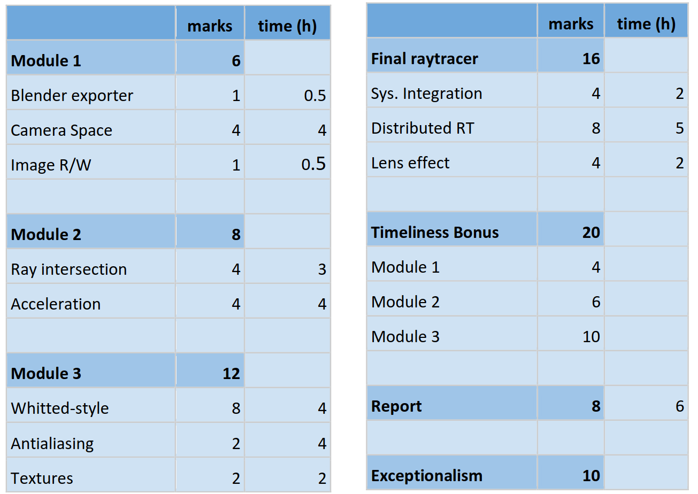

100% of the features listed above were completed.

# Usage

The raytracer parses `ASCII/scene.txt` which contains the objects and object data exported from Blender. To export this data from Blender, load and run the `Blend/Export.py` in the `Blend/scene.py` file. Details on structuring the scene for parsing can be found in [Parameters](#parameters).

Once the `scene.txt` has been generated, the code can be executed. By default it will run without any command line arguments, however it can be tuned using the `Code/config.json` parameters and the command line arguments described in [Parameters](#parameters).   

The resulting image is saved as a `.ppm` file in `Output/scene_test.ppm`.

## Example Outputs

### Module 1

#### Blender exporter

In module 1, the `ASCII/scene.txt` contains the following information:
* Cameras
  * Location
  * Direction of the gaze and up vectors
  * Focal length
  * Sensor width and height
  * Film resolution
* Point lights
  * Location
  * Radiant intensity
* Spheres
  * Location
  * Radius (1D)
* Cubes
  * Translation
  * Rotation
  * Scale (1D)
* Planes
  * 3D coordinates of its four corners

An example output of `ASCII/scene.txt` for module 1 can be found at `Report/examples/M1/scene.txt`. This was tested by manually entering the values in the text file into a new object in Blender, and checking that it overlaps with the existing object.

#### Camera space transformations
The camera class and header files can be found in `Code/environment/camera.h` and `Code/environment/camera.cpp`. In module 1, the file is read by the camera class and information stored. A vector3 class and a ray class are implemented to structure the data.

#### Image read and write

The functionality for image reading and writing can be found in `Code/utilities/scene.h` and `Code/utilities/scene.cpp`. This was tested by reading a `.ppm` file of a generic gradient, replacing some pixels' colour values with white, and writing it back to a `.ppm`.
<table style="width: 100%; border: none;">
  <tr>
    <td style="width: 50%; padding: 10px; text-align: center; border: none;">
      
      <p style="text-align: center;"><b>Figure 1:</b> Read file</p>
    </td>
    <td style="width: 50%; padding: 10px; text-align: center; border: none;">
      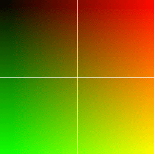
      <p style="text-align: center;"><b>Figure 2:</b> Write file</p>
    </td>
  </tr>
</table>

### Module 2

#### Ray Intersection

Module 2 was tested by overlaying the original Blender file with the output from the raytracer and checking that they match. To generate the output, I coloured the ray intersections according to the normal of the ray with the object.

<table style="width: 100%; border: none;">
  <tr>
    <td style="width: 50%; padding: 10px; text-align: center; border: none;">
      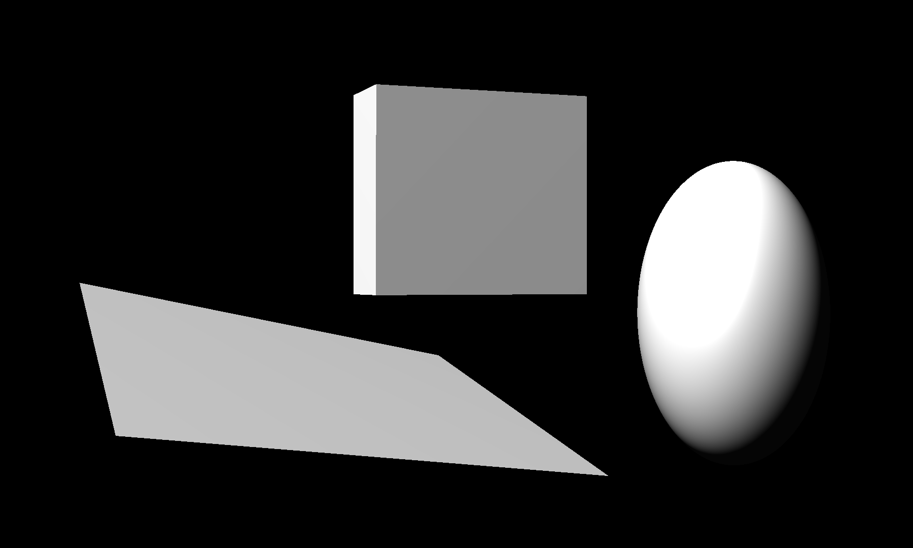
      <p style="text-align: center;"><b>Figure 1: </b>Generated image</p>
    </td>
    <td style="width: 50%; padding: 10px; text-align: center; border: none;">
      
      <p style="text-align: center;"><b>Figure 2: </b>Original Blender scene</p>
    </td>
  </tr>
</table>


#### Acceleration Hierarchy

A bounding volume hierarchy is implemented to improve the efficiency of intersection tests for scenes with many shapes. The speedup for scenes with different numbers of objects is shown in [Figure 1](#figure-1). Scene data can be found in `Report/examples/M2/bvh_tests`. Each test was run 3 times and averaged. As shown, the gap in runtime between runs with and without bvh increases as the number of items in the scene increases.


<table style="width: 100%; border: none;">
  <tr>
    <td style="width: 100%; padding: 10px; text-align: center; border: none;">
      <a id="figure-1"></a>
      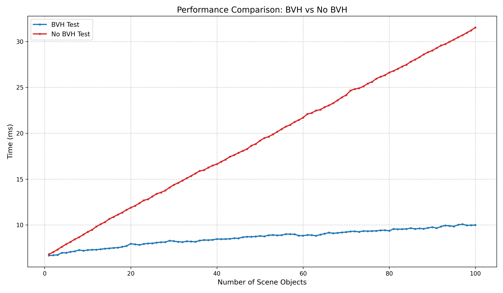
      <p style="text-align: center;"><b>Figure 1: </b>Runtime with and without BVH</p>
    </td>
  </tr>
</table>

### Module 3

#### Whitted-style raytracing

The Blinn-Phong model was implemented early in module 2, however it was refined in module 3. It responds to specular, diffuse, and ambient values in each colour channel. See `Report/examples/M3` for scene data.

<table style="width: 100%; border: none;">
  <tr>
    <td style="width: 50%; padding: 10px; text-align: center; border: none;">
      <a id="figure-1"></a>
      
      <p style="text-align: center;"><b>Figure 1: </b>Original Blender scene</p>
    </td>
    <td style="width: 50%; padding: 10px; text-align: center; border: none;">
      <a id="figure-2"></a>
      
      <p style="text-align: center;"><b>Figure 2: </b>Raytraced scene</p>
    </td>
  </tr>
</table>

A tracer is also implemented, which tracks the path of a ray when it encounters transparent objects or moves between mediums with different refractive indices.

<table style="width: 100%; border: none;">
  <tr>
    <td style="width: 50%; padding: 10px; text-align: center; border: none;">
      <a id="figure-1"></a>
      
      <p style="text-align: center;"><b>Figure 1: </b>Original Blender scene</p>
    </td>
    <td style="width: 50%; padding: 10px; text-align: center; border: none;">
      <a id="figure-2"></a>
      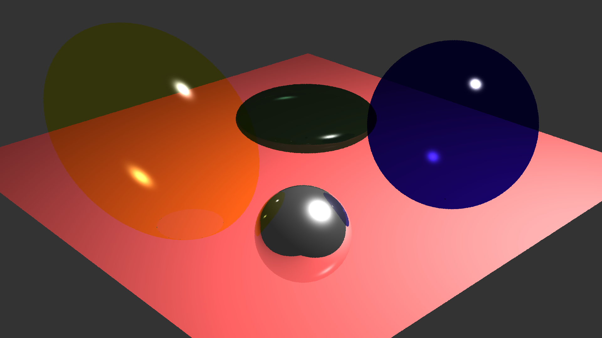
      <p style="text-align: center;"><b>Figure 2: </b>Raytraced scene</p>
    </td>
  </tr>
</table>

Note that in the above scene, the Blender uses the glass BSDF.

Finally, Fresnel equations were implemented to weight the reflection and refraction contributions more realistically. This is enabled with the `--fresnel` flag.

<table style="width: 100%; border: none;">
  <tr>
    <td style="width: 50%; padding: 10px; text-align: center; border: none;">
      <a id="figure-1"></a>
      
      <p style="text-align: center;"><b>Figure 1: </b>Transparent sphere with the Fresnel effect.</p>
    </td>
    <td style="width: 50%; padding: 10px; text-align: center; border: none;">
      <a id="figure-2"></a>
      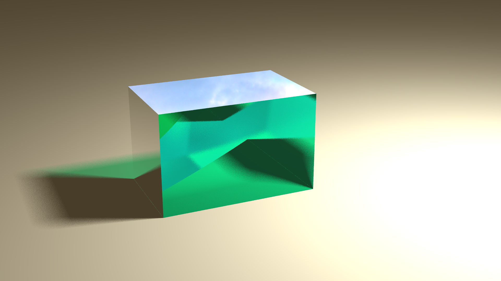
      <p style="text-align: center;"><b>Figure 2: </b>Transparent cube with the Fresnel effect.</p>
    </td>
  </tr>
</table>

Note that for both of these images a background and soft shadows was used in the scene.

#### Anti-aliasing

Anti-aliasing can be set with the `--aa <int>` flag where the second argument is the number of samples to take.

<table style="width: 100%; border: none;">
  <tr>
    <td style="width: 50%; padding: 10px; text-align: center; border: none;">
      <a id="figure-1"></a>
      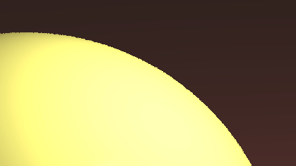
      <p style="text-align: center;"><b>Figure 1: </b>Anti-aliasing (samples = 1)</p>
    </td>
    <td style="width: 50%; padding: 10px; text-align: center; border: none;">
      <a id="figure-2"></a>
      
      <p style="text-align: center;"><b>Figure 2: </b>Anti-aliasing (samples = 16)</p>
    </td>
  </tr>
</table>

#### Textures

For spheres and planes, the texture is stretched to fit the surface of the object. For cubes, the uv texture is treated as a net that wraps around the object, allowing different patterns to be displayed on different faces. 

<table style="width: 100%; border: none;">
  <tr>
    <td style="width: 33%; padding: 10px; text-align: center; border: none;">
      <a id="figure-1"></a>
      
      <p style="text-align: center;"><b>Figure 1: </b>Sphere texture</p>
    </td>
    <td style="width: 33%; padding: 10px; text-align: center; border: none;">
      <a id="figure-2"></a>
      
      <p style="text-align: center;"><b>Figure 2: </b>Plane texture</p>
    </td>
    <td style="width: 33%; padding: 10px; text-align: center; border: none;">
      <a id="figure-3"></a>
      
      <p style="text-align: center;"><b>Figure 2: </b>Cube texture</p>
    </td>
  </tr>
</table>


### Final Raytracer

#### System Integration

As described in [Parameters](#parameters), features can be easily turned on and off using command line arguments.

#### Distributed Raytracing

Soft shadows are implemented by casting multiple shadow rays towards a light source with a radius greater than 0.0. The number of rays is controlled by the `shadow_samples` parameter in `config.json`. The final light contribution is averaged over all the shadow rays, creating a softer shadow edge. This is compatible with the existing implementation for the point lights, but does require point lights to have a radius in their custom properties.

<table style="width: 100%; border: none;">
  <tr>
    <td style="width: 33%; padding: 10px; text-align: center; border: none;">
      <a id="figure-basic-shadow"></a>
      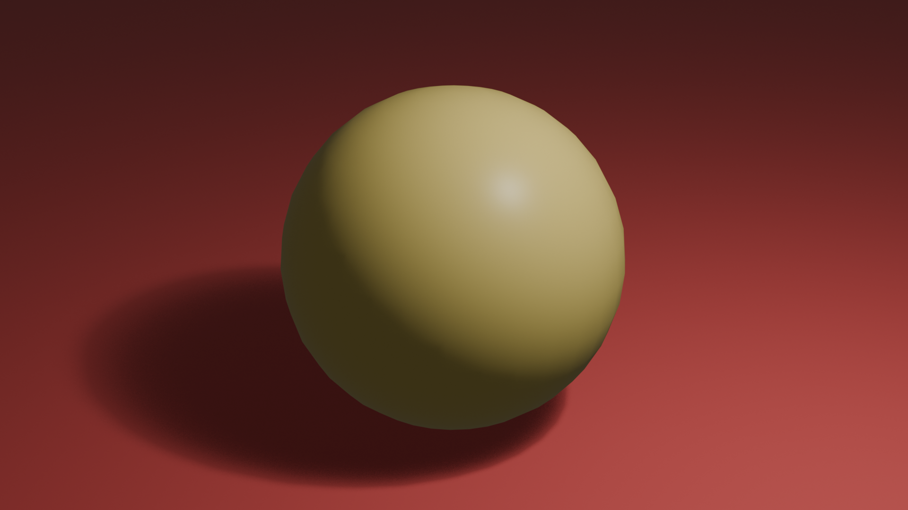
      <p style="text-align: center;"><b>Figure 1: </b>Original Blender Scene</p>
    </td>
    <td style="width: 33%; padding: 10px; text-align: center; border: none;">
      <a id="figure-soft-shadow"></a>
      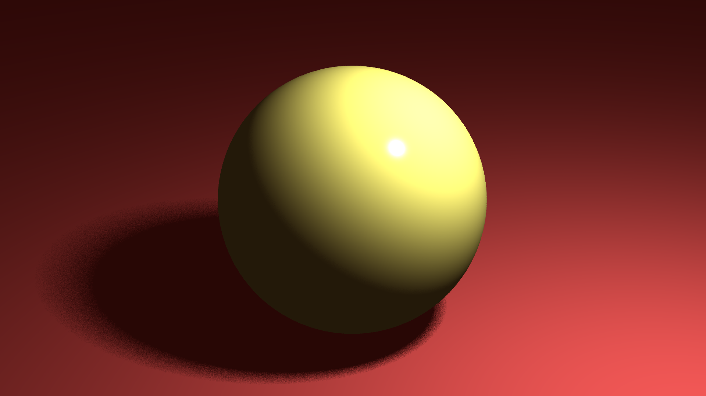
      <p style="text-align: center;"><b>Figure 2: </b>Soft shadow implementation (samples = 4)</p>
    </td>
  </tr>
</table>

Glossy reflection also casts multiple rays to approximate blurred specular highlights, averaging their contributions to produce rough reflections controlled by the material's glossiness.


<table style="width: 100%; border: none;">
  <tr>
    <td style="width: 50%; padding: 10px; text-align: center; border: none;">
      <a id="figure-basic-shine"></a>
      
      <p style="text-align: center;"><b>Figure 1: </b>Basic shiny surface</p>
    </td>
    <td style="width: 50%; padding: 10px; text-align: center; border: none;">
      <a id="figure-glossy"></a>
      
      <p style="text-align: center;"><b>Figure 2: </b>Sampled glossy surface (samples = 4)</p>
    </td>
  </tr>
</table>

#### Lens effects

Each object can have a 3D velocity vector attached to it via a custom property. If used with the `--motion-blur <float>` flag, where the float is the time the shutter time, it calculates a motion blue for moving objects in the scene. As with the other examples in this documentation, information on the scene and flags used to generate this is example can be found in `Report/examples/final/`

<table style="width: 100%; border: none;">
  <tr>
    <td style="width: 50%; padding: 10px; text-align: center; border: none;">
      <a id="figure-motion-blur-blender"></a>
      
      <p style="text-align: center;"><b>Figure 1: </b>Original Blender scene with moving objects</p>
    </td>
    <td style="width: 50%; padding: 10px; text-align: center; border: none;">
      <a id="figure-motion-blur"></a>
      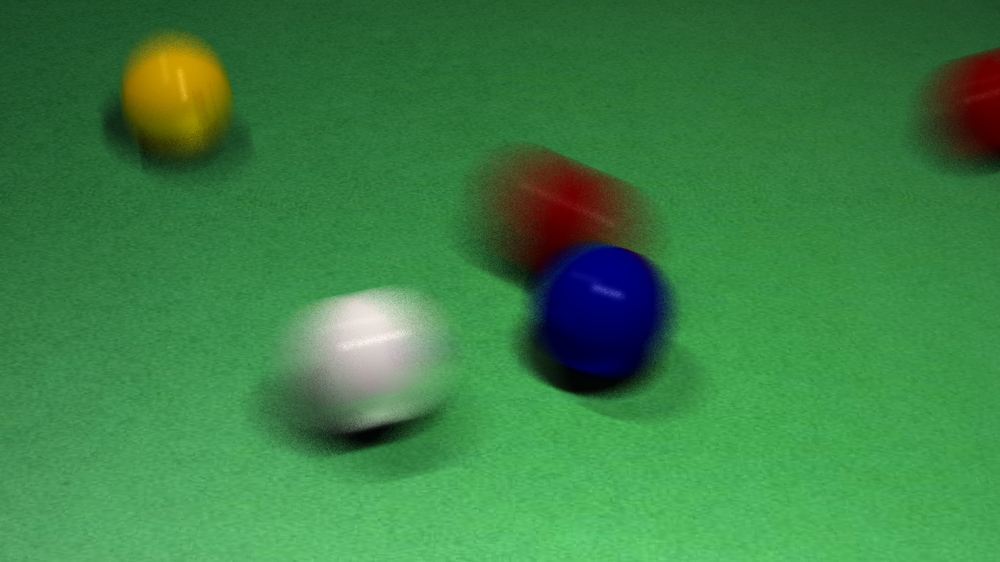
      <p style="text-align: center;"><b>Figure 2: </b>A scene with objects travelling at different velocities.</p>
    </td>
  </tr>
</table>

The raytracer also implements depth of field blur. By setting the F-Stop and Focal Distance in the Blender camera settings, the raytracer simulates a camera lens with a finite aperture size. Rays are sampled across the aperture, creating a realistic depth of field effect where objects outside the focal plane appear blurred.

<table style="width: 100%; border: none;">
  <tr>
    <td style="width: 33%; padding: 10px; text-align: center; border: none;">
      <a id="figure-dof-A"></a>
      
      <p style="text-align: center;"><b>Figure 1: </b>Original Blender scene (f-stop = 2.0, focal length = 2.5)</p>
    </td>
    <td style="width: 33%; padding: 10px; text-align: center; border: none;">
      <a id="figure-dof-B"></a>
      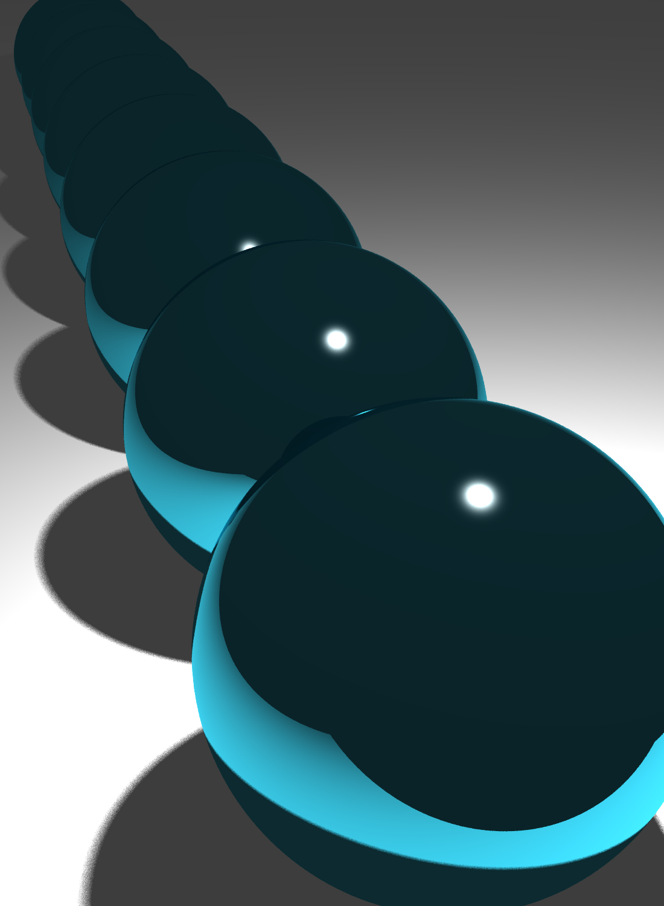
      <p style="text-align: center;"><b>Figure 2: </b>Raytraced scene without depth of field</p>
    </td>
    <td style="width: 33%; padding: 10px; text-align: center; border: none;">
      <a id="figure-dof-C"></a>
      
      <p style="text-align: center;"><b>Figure 3: </b>Raytraced scene with depth of field (f-stop = 2.0, focal length = 2.5)</p>
    </td>
  </tr>
</table>

### Exceptionality

#### Multi-threading

Multi-threading was implemented to allow parallel threads to process lines of the image simultaneously. This is enabled with the `--parallel` flag. If OpenMP is not available on the system, the program will run with a single thread, so the system should be portable. As an example of the speed-up achievable with this feature, the image in the `HDR Backgrounds` section took 80.6859 seconds to render with multi-threading, and 698.221 seconds without.

#### Filetype conversion

As it is easier to find textures in `.png`, `.jpg`, or `.jpeg` format, the code includes the ability to convert these file types to `.ppm`. This code uses `python`, and so it fails gracefully if used on a system that does not have python installed. 

#### HDR Backgrounds 

The raytracer can read in HDR background images in `.pfm` format. These images are sampled when a ray does not intersect with any objects in the scene, providing realistic lighting and reflections from the environment. The implementation uses a simple spherical mapping technique to map the 2D HDR image onto a virtual sphere surrounding the scene. This raytracer works with equirectangular maps and is not compatible with cube maps.


<table style="width: 100%; border: none;">
  <tr>
    <td style="width: 100%; padding: 10px; text-align: center; border: none;">
      <a id="figure-HDR-A"></a>
      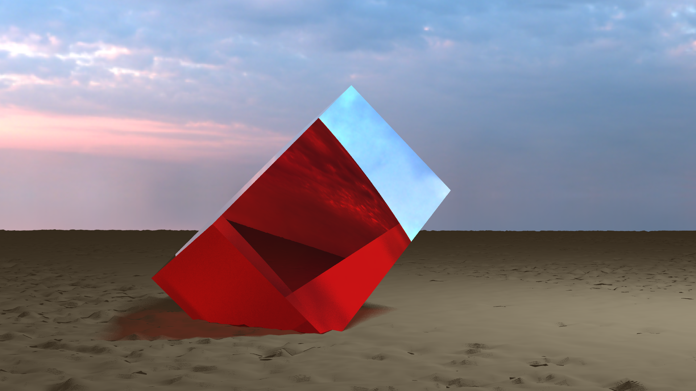
      <p style="text-align: center;"><b>Figure 1: </b>A scene with an HDR background</p>
    </td>
  </tr>
</table>

#### Normal mapping

Textures can be applied to shapes to perturb the normal for lighting calculations without affecting the objects geometry. 


<table style="width: 100%; border: none;">
  <tr>
    <td style="width: 50%; padding: 10px; text-align: center; border: none;">
      <a id="figure-bump-map-A"></a>
      
      <p style="text-align: center;"><b>Figure 1: </b>A scene with a normal mapped shape</p>
    </td>
    <td style="width: 50%; padding: 10px; text-align: center; border: none;">
      <a id="figure-bump-map-B"></a>
      
      <p style="text-align: center;"><b>Figure 2: </b>A scene with a normal mapped shape</p>
    </td>
  </tr>
</table>

#### Displacement mapping

This changes the geometry of the object. Therefore, while XXX objects still have smooth sillhoeuttes that match their original shape, XXX objects have bumped outlines.


<table style="width: 100%; border: none;">
  <tr>
    <td style="width: 50%; padding: 10px; text-align: center; border: none;">
      <a id="figure-displacement-map-A"></a>
      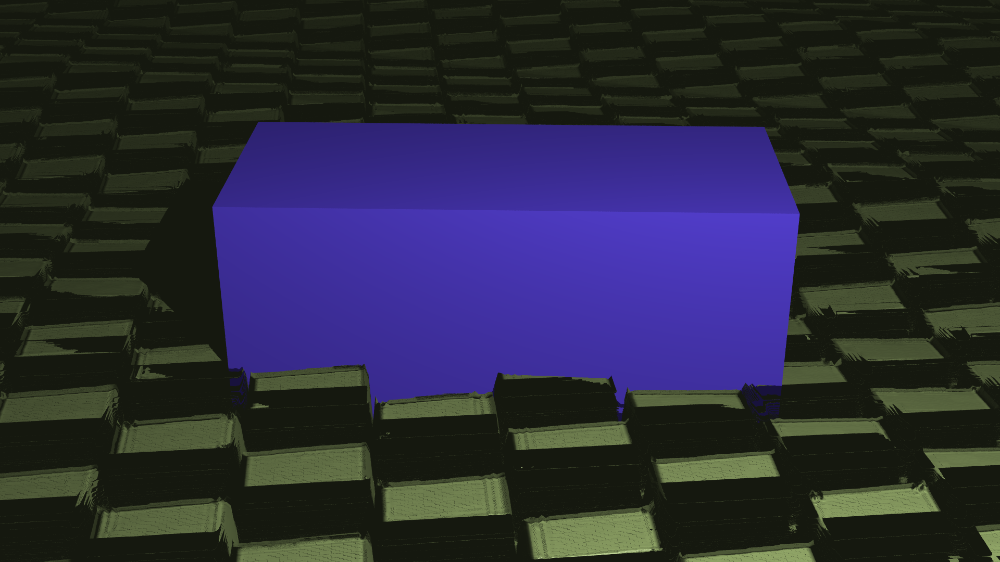
      <p style="text-align: center;"><b>Figure 1: </b>A scene including a plane with a displacement map.</p>
    </td>
    <td style="width: 50%; padding: 10px; text-align: center; border: none;">
      <a id="figure-displacement-map-B"></a>
      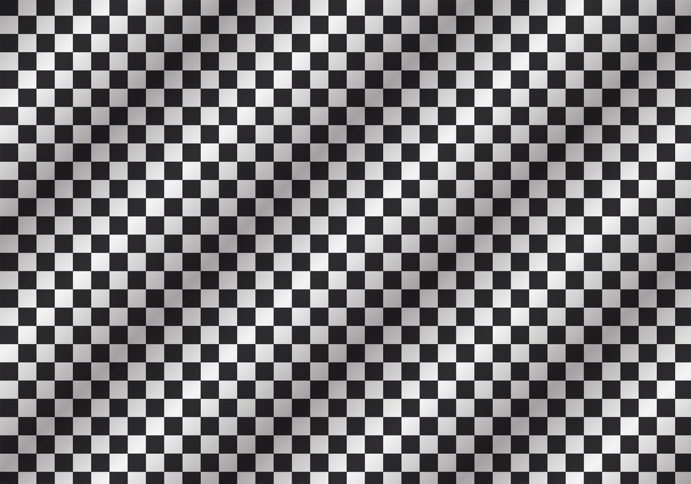
      <p style="text-align: center;"><b>Figure 2: </b>The corresponding displacement map.</p>
    </td>
  </tr>
</table>

#### Metal material

While experimenting with glass objects, I discovered that it was possible to create metal objects by forcing the reflection of an object to transmit the colour of the object. 


<table style="width: 100%; border: none;">
  <tr>
    <td style="width: 50%; padding: 10px; text-align: center; border: none;">
      <a id="figure-metal-A"></a>
      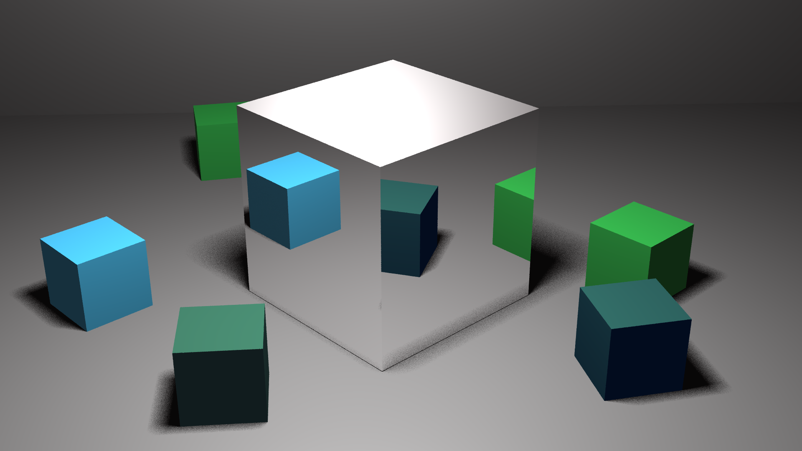
      <p style="text-align: center;"><b>Figure 1: </b>A scene with a glass mirror, which cannot be tinted with colour.</p>
    </td>
    <td style="width: 50%; padding: 10px; text-align: center; border: none;">
      <a id="figure-metal-B"></a>
      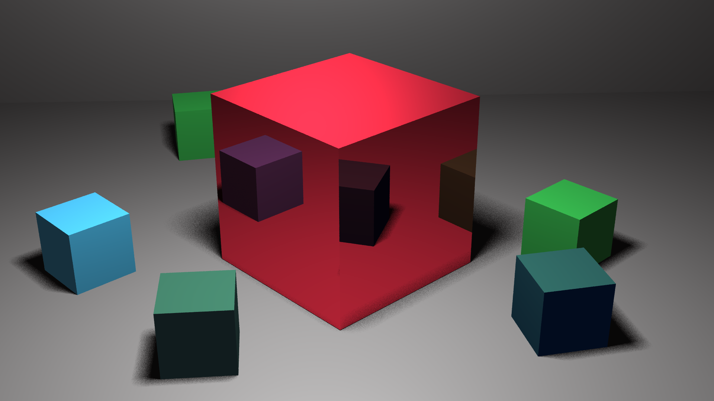
      <p style="text-align: center;"><b>Figure 2: </b>A scene with a metal mirror, capable of being tinted.</p>
    </td>
  </tr>
</table>

#### Exposure control 

This flag allows finer control of the environment brightness. 


<table style="width: 100%; border: none;">
  <tr>
    <td style="width: 50%; padding: 10px; text-align: center; border: none;">
      <a id="figure-exposure-A"></a>
      
      <p style="text-align: center;"><b>Figure 1: </b>A scene with low exposure (exposure = 0.04)</p>
    </td>
    <td style="width: 50%; padding: 10px; text-align: center; border: none;">
      <a id="figure-exposure-B"></a>
      
      <p style="text-align: center;"><b>Figure 2: </b>A scene with high exposure (exposure = 0.16)</p>
    </td>
  </tr>
</table>

#### Tonemapping

Tonemapping was implemented as an optional `--tonemap <algorithm>` flag. The implemented algorithms are:
* Reinhard: this uses the function $C_d = \frac{C}{1+C}$ where $C$ is the colour vector.
* ACES: this uses an S-shaped contrast curve. The values are calculated using
  [Krzysztof Narkowicz's](https://knarkowicz.wordpress.com/2016/01/06/aces-filmic-tone-mapping-curve/) values in the S-curve equation $\frac{x  (a  x + b)}{x  (c  x + d) + e}$ where x is the value of a colour channel.
* Filmic: this algorithm applies the equation $\frac{(x (ax + cb) + d e) }{x(ax + b) + d f)} - \frac{e}{f}$ with values from [John Hable](http://filmicworlds.com/blog/filmic-tonemapping-operators/), where x is the value of a colour channel. 

The algorithms are applied to each pixel after the colour has been calculated to map the HDR colour range to a limited range. Without the inclusion of this flag, the values are simply clamped to the range of 0.0 to 1.0.

While the values of the pixels can be controlled with the `--exposure <float>` flag, this scales the values of the pixels linearly. Tonemapping adjusts the values more intelligently, for example crushing highlights or shadows more aggressively than the midtones. Exposure and tonemapping can be used in tandem to control the general brightness of the scene with artistic choices about how the light should be interpreted.  

<table style="width: 100%; border: none;">
  <tr>
    <td style="width: 50%; padding: 10px; text-align: center; border: none;">
      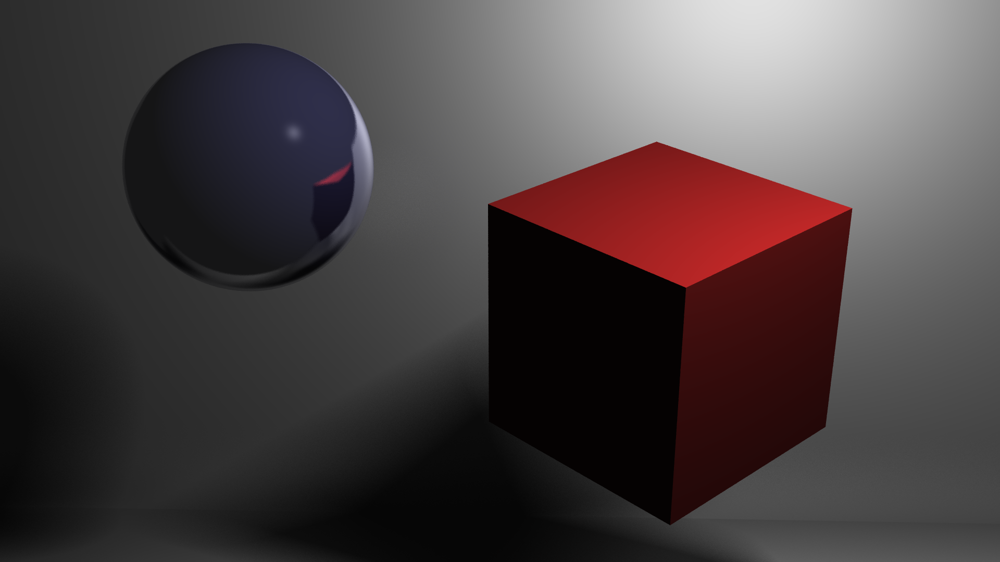
      <p style="text-align: center;"><b>Figure 1: </b>No tonemapping</p>
    </td>
    <td style="width: 50%; padding: 10px; text-align: center; border: none;">
      
      <p style="text-align: center;"><b>Figure 2: </b>Reinhard tonemapping</p>
    </td>
  </tr>
  <tr>
    <td style="width: 50%; padding: 10px; text-align: center; border: none;">
      
      <p style="text-align: center;"><b>Figure 3: </b>ACES tonemapping</p>
    </td>
    <td style="width: 50%; padding: 10px; text-align: center; border: none;">
      
      <p style="text-align: center;"><b>Figure 4: </b>Filmic tonemapping</p>
    </td>
  </tr>
</table>

This is particularly useful for scenes with more than one light, as it prevents both being scaled relative to their impact on the scene, instead of both being clamped to 1.0. In this way, tonemapping can be used to improve realism. 

<table style="width: 100%; border: none;">
  <tr>
    <td style="width: 50%; padding: 10px; text-align: center; border: none;">
      
      <p style="text-align: center;"><b>Figure 1: </b>No tonemapping</p>
    </td>
    <td style="width: 50%; padding: 10px; text-align: center; border: none;">
      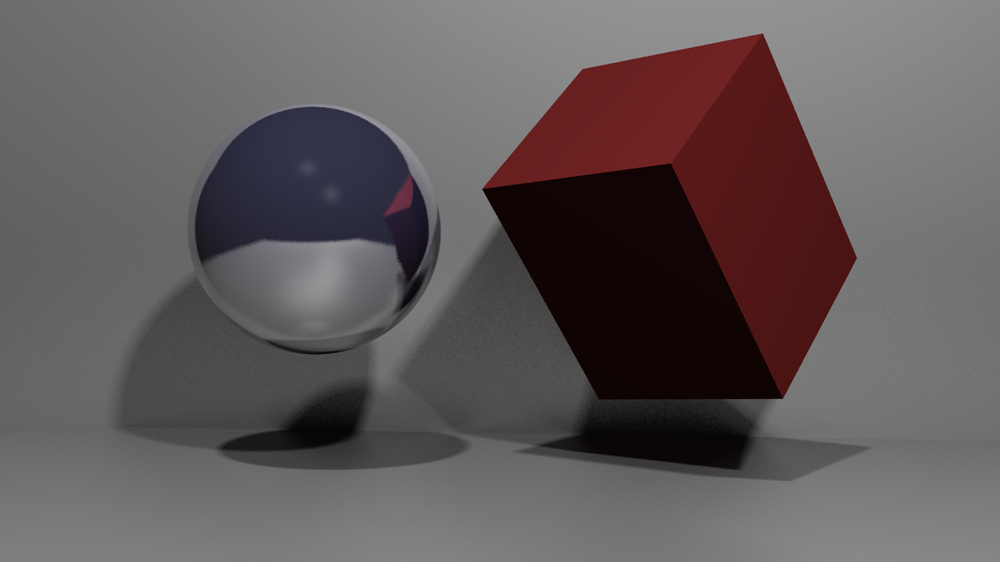
      <p style="text-align: center;"><b>Figure 2: </b>Reinhard tonemapping</p>
    </td>
  </tr>
  <tr>
    <td style="width: 50%; padding: 10px; text-align: center; border: none;">
      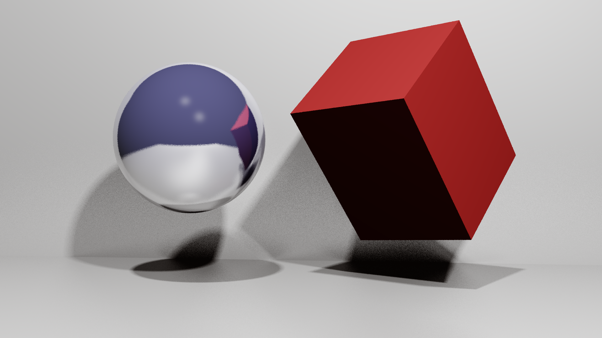
      <p style="text-align: center;"><b>Figure 3: </b>ACES tonemapping</p>
    </td>
  </tr>
</table>

# Further Examples

This gallery features further examples of the aforementioned features. All scene and flag data can be found in `Report/examples/gallery`.

## Paris Bust

In 3D modelling, mesh topology is typically constructed using quadrilateral faces, as they lead to cleaner edge loops which improves the results of animation. However, the points of a quad are not guaranteed to be coplanar, so before being rendered the quads are triangulated. This is because by definition, all points of a triangle must lie on the same plane. This prevents all sorts of geometry related nonsense.

Although my raytracer works with quadrilateral planes, I argue that, for the purposes of this project, a triangle is a quadrilateral where one side is of negligible length, thus my raytracer can render triangles, thus it can render any triangulated object. This opens up the opportunity to render any 3D object, by treating each of the objects triangle faces as a quadrilateral plane. This is demonstrated below, using a scanned model of the Bust of Paris, (Antonio Canova, 1809, Marble, Art Institute of Chicago) from MattMSI@thingiverse.

<table style="width: 100%; border: none;">
  <tr>
    <td style="width: 33%; padding: 10px; text-align: center; border: none;">
      <a id="figure-dof-A"></a>
      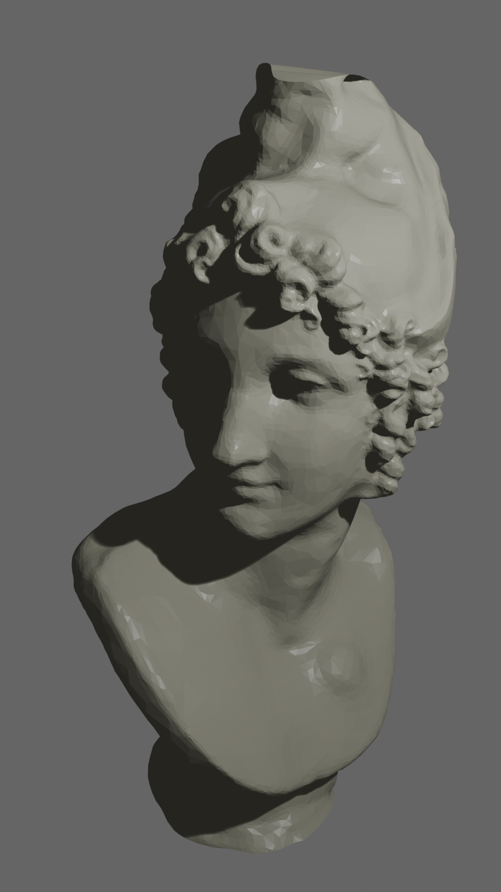
      <p style="text-align: center;"><b>Figure 1: </b>Original Blender scene.</p>
    </td>
    <td style="width: 33%; padding: 10px; text-align: center; border: none;">
      <a id="figure-dof-B"></a>
      
      <p style="text-align: center;"><b>Figure 2: </b>Normal visualisation of scene.</p>
    </td>
    <td style="width: 33%; padding: 10px; text-align: center; border: none;">
      <a id="figure-dof-C"></a>
      
      <p style="text-align: center;"><b>Figure 3: </b>Raytraced scene, 35000 faces.</p>
    </td>
  </tr>
</table>

Naturally it is also possible to colour the planes individually. In future, an extension would be to unwrap the faces for painting, and then use the inverted unwrapping algorithm to map the UV texture back onto the faces. Bicycle model from wasabicats@Sketchfab.


<table style="width: 33%; border: none;">
  <tr>
    <td style="width: 100%; padding: 10px; text-align: center; border: none;">
      <a id="figure-dof-A"></a>
      
      <p style="text-align: center;"><b>Figure 1: </b>Bicycle, 7000 faces.</p>
    </td>
  </tr>
</table>

Material properties applicable to the basic shapes are also applicable to the complex shapes.


<table style="width: 50%; border: none;">
  <tr>
    <td style="width: 100%; padding: 10px; text-align: center; border: none;">
      <a id="figure-dof-A"></a>
      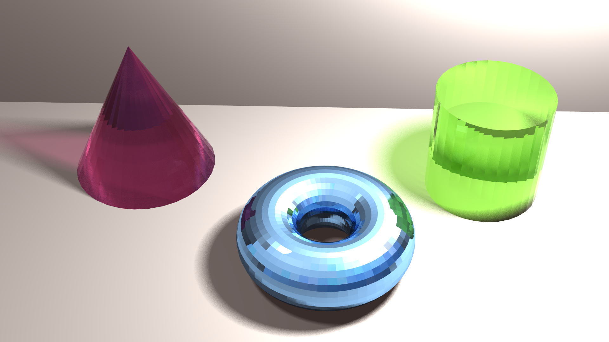
      <p style="text-align: center;"><b>Figure 1: </b>Shapes, 5000 faces.</p>
    </td>
  </tr>
</table>

# Timeliness

All deadlines were met, with the corresponding features implemented in each module.


## Deviations
### Module 1
This module involved a python exporter which took limited data about objects. For example, module 1 did not require any data about the material of the object and so future versions of the exporter has additional functionality to retrieve material data.

Additionally this module exported 1D scales for the shapes, whereas later versions retrieved values for scale in 3D dimensions. Similarly, the intensity of the light at this point is a 1D vector, whereas in future this was changed to a 3D vector to allow the light to be coloured. The values of this new vector represent the intensity of each colour channel.

Finally, the methods for reading the file from the exporter are in the camera class and header in M1. In future, they are moved to `Code/utilities/scene.cpp` and `Code/utilities/scene.h` for tidiness. 

### Module 2


The intensity vector for the light in this is now a 3D vector to allow coloured lighting. 

<table style="width: 100%; border: none;">
  <tr>
    <td style="width: 50%; padding: 10px; text-align: center; border: none;">
      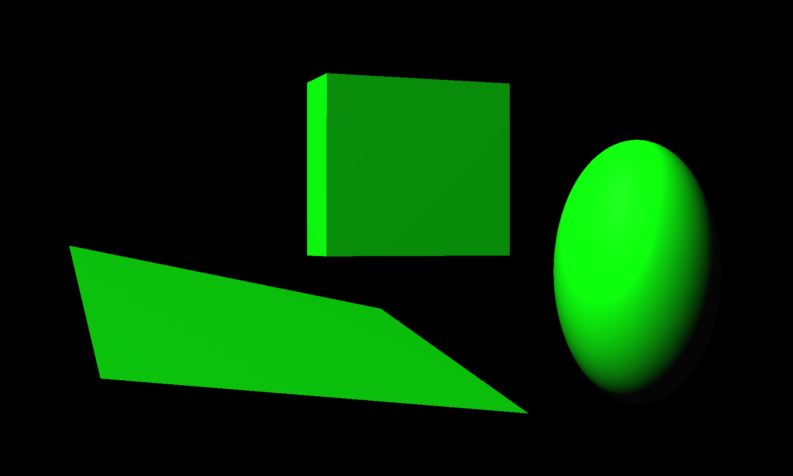
      <p style="text-align: center;"><b>Figure 1: </b>Generated image</p>
    </td>
    <td style="width: 50%; padding: 10px; text-align: center; border: none;">
      
      <p style="text-align: center;"><b>Figure 2: </b>Original Blender scene</p>
    </td>
  </tr>
</table>

The python exporter also now identifies mesh types by counting the number of polygons, which is a more robust method than relying on the name of the shape.

Additionally, in module 1 the bounds for the cube intersection were +-0.5, but this is changed to +-1.0 after discovering that Blender uses a non-standard system for scaling.

Module 2 also has an additional `Code/utilities/shading.h`, which is responsible for Blinn Phong shading (I was ahead of schedule and so implemented this in module 2 instead of 3). A corresponding material structure, `Code/shapes/material.h`, was added to store the relevant material properties. In module 2, this is just ambient diffuse specular and shininess.

A class was added to represent 4x4 matrices, `Code/utilities/matrix4x4.h` and `Code/utilities/matrix4x4.cpp`, providing utilities for geometric transformations. This was also added to transform rays, as it is computationally more efficient to transform a ray and test it for an intersection against a unit shape than test the original ray against a transformed shape.

A structure was added for the light, `Code/environment/light.h`, necessary for Blinn-Phong. In module 2 this structure simply holds the lights position and intensity.

Classes were added for each of the shapes (circle, plane and, cube in `Code/shapes/`) to allow a different intersection method to be used for each. They inherit from the base class of `Code/shapes/hittable.h` which is contained by `Code/shapes/hittable_list.h` and `Code/shapes/hittable_list.cpp`. This simplifies the raytracer logic for intersection tests, and allows easy iteration through hittable objects.

This module also sees the addition of the BVH acceleration, implemented in `Code/acceleration/bvh.h` and `Code/acceleration/bvh.cpp`. It is built using an AABB (Axis-Aligned Bounding Box) tree,`Code/acceleration/aabb.cpp` and `Code/acceleration/aabb.h`, for computational efficiency.


### Module 3

To account for the new depth of focus blur, soft shadows, and motion blur, `Blend/Export.py` is adjusted to read properties related to these features. `Code/utilities/scene.h` and `Code/utilities/scene.cpp` are updated to parse this information.

`Code/environment/camera.h` and `Code/environment/camera.cpp` are updated to store the new information related to focus blur.

`Code/environment/light.h` is updated to store information about the radius of the point light, which is used in soft shadow calculations.

The intersection methods in `Code/shapes/` are updated to account for the time variable used for motion blur calculations, and the time variable is added as a property to `Code/utilities/ray.h`.

A new class, `Code/utilities/vector2.h`, is added for mapping 2D texture coordinates.

`Code/shapes/material.h` is updated to include information about reflectivity, transparency, refractive index and textures.

`Code/utilities/shading.h` is updated to deal with textures and soft shadows.

`Code/utilities/tracer.h` is added to deal with calculations related to reflective or transparent materials. This class traces a ray to a specified recursion depth, calculating the rays new direction at each intersection depending on the materials properties.

### Final Raytracer

`Export.py` is updated to retrieve information regarding object materials, displacement map textures, HDR backgrounds, depth of field camera data, and velocity. It was also updated to deal with complex objects, which changes the way in which displacement/normal maps are applied (either by changing the geometry of the object or by perturbing the normal vector).

The previous implentation used a sensor size imported from Blender. I discovered that this might not necessarily be the correct aspect ratio, which was causing vertical squashing in my output images. Therefore, since the module 3 submission I have updated it to calculate sensor size according to the Blender camera aspect ratio.

Calculations for normal mapping are added to the basic shapes files, and new classes for their complex counterparts added with intersection methods for displacement mapping.

The calculations for the final pixel colour is changed from a simple clamp to various tonemapping methods.

`Code/shapes/HDRImage.cpp` and `Code/shapes/HDRImage.h` are added to allow the use of background images instead of a default colour.

A significant amount of refactoring was also done across the files, for example `Code/shapes/transformed_shape.h` was added as base class for transformable shapes to avoid code duplication in the shape files. 

# Prompts


Examples of prompts used.

## Module 1
-----------------------------------------------------------------------
### Blender exporter:
```update the export.py to check for a custom property called 'velocity' on the active material. if present, write this 3d vector to the scene file to be used for motion blur.```

I changed the way the generated export python file identifies mesh types. Instead of using the name of the mesh, I changed it to use a more robust method of counting polygons.

### Raytracing from a camera:

```Explain the benefits of using the U V W coordinate system over the yaw, pitch, roll system.```

### Image read and write in `.ppm` format:
``` Update this function to include P6 files.```

## Module 2
-----------------------------------------------------------------------
### Ray intersection for sphere, plane and cube objects:
```Adjust the plane intersection method to account for planes that do not have right angled corners by splitting into triangles and checking for intersection with each triangle.```

```Write a corresponding intersection function for a cube.```

Edits had to be made to account for the Blender system using +-1.0 instead of +-0.5 for cubes

The assistant advised on the use of a matrix for defining a basic cube and then creating a transformation matrix to define its location, rotation and scale in the world.

### Acceleration hierarchy using the bounding volume hierarchy:
```Explain the term AABB tree in the context of bvh acceleration.```

```Correct the implementation based on this error.```

```Adjust this function to switch between the x and y axis for efficiency.```

## Module 3
-----------------------------------------------------------------------
### Whitted-Style ray tracing, shading intersections according to the Blinn-Phong model:
``` implement the blinn-phong shading model in a class called shading.h. calculate the diffuse component using the dot product of the surface normal and the light direction. ```

``` update the shading logic in shading to include an ambient term. read the ambient coefficient from the material properties and multiply it by the object's base color.```
### Traced refracted/reflected rays:

The generated code did not include the fresnel effect, so I made changes to add this.

``` add a refraction helper function in tracer.h using snell's law. calculate the transmitted ray direction based on the ratio of refractive indices.```

### Antialiasing using average contributions of samples:
``` explain alternative methods of anti-aliasing ```

``` modify the pixel loop in main.cpp to support multiple samples. generate random offsets within the pixel square and average the resulting colors.```

``` Look for sources of inefficiency within this class ```
### UV textures mapped to shapes:
``` create a vector2 struct vector2.h to hold u and v texture coordinates. add basic operator overloading for addition and scalar multiplication.```

``` implement a spherical mapping function in this file. convert the intersection point on the unit sphere into normalized u and v coordinates using atan2 and acos.```

I made changes to the generated code so that for cubes, instead of tiling the same pattern onto all sides, the texture is a net that folds around the cube.

## Final Raytracer

-----------------------------------------------------------------------
### Soft shadows


``` What is causing hard shadows even after impplementing shadow sampling? ```

``` modify the light struct in the light file to include a floating point radius. update the parsing logic in the scene file to read this value from the scene description file.```

I modified the generated code such that shadows from a transparent object transmit colour.

### Implementation of glossy reflection via distributed raytracing:
``` Explain what is meant by 'glossy reflection' in the context of raytracing ```

### Motion blur:

``` Check for places that are missing the time parameter. ```

I made changes to the generated code as it was missing motion blur in reflections and shadows.

### Depth of field blur:

``` Do i need to use sampling for depth of field blur in the same way i used it for motion blur? ```

``` modify the ray generation in camera.cpp. calculate the focal point at the focus distance and cast the ray from the sampled aperture point to this focal point.```
## Exceptionality
-----------------------------------------------------------------------
### Multi-threading:

``` I'd like to add multi-threading, is this a non-trivial problem? ```

``` What do I add to my cmakelists.txt so that it fails gracefully if the system it is run on doesnt have OpenMP.```
### `.jpeg`, `.jpg`, or `png` texture conversion:

``` Is it possible to convert from .jpeg, .jpg, .png to .ppm with just the standard C++ library? ```

``` Adjust this conversion so that it fails gracefully on a system that is missing python. ```
### HDR background images:

``` Explain the difference between equirectangular background images and cube maps. ```

``` Using this UV coordinate code as a base, update the background for .pfm images. ``` 
### Normal mapping:

``` If normal mapping is making values darker or lighter based on the corresponding texture file,m why doesn't this code work? ```
### Displacement mapping:

```update complex_sphere.cpp to adjust the radius at a given point based on the displacement map value. recalculate the geometry based on the local gradient of the map.```
### Metal material:

``` Artistically I like the look of the tinted glass. help me add it as a new material so that i can toggle it on and off. ```
### Exposure control:

``` Add a simple flag to let me control exposure via command line ```
### Tone mapping (interchangeable Reinhard, ACES, and Filmic):

``` how can i know what values to use for the S-curve in reinhard? ```

``` Describe a blender scene to demonstrate the differences between these tonemapping modes.```


# Coding Assistant Assessment

The coding assistant was an invaluable tool that helped overcome the challenges of using an unfamiliar language, C++. I used it to explain C++ keywords and convert code from Python.

Beyond the core coursework, the assistant helped generate Blender scripts (like Decompose_scene.py) and plotting files to quickly set up scenes and analyze data. This significantly saved time on non-core tasks, adding a layer of polish.

The assistant was also highly effective for debugging, quickly identifying issues like incorrect material property settings (e.g., shininess causing white noise). Finally, it proved essential for refactoring and optimisation, making these complex tasks manageable given my limited C++ experience.

Some notable downsides were that as the project grew, it became harder to get desirable outputs from the assistant. As there is a limit on how many files I could provide it, I had to abandon the idea of providing it with full context, and either be very careful to request tasks that could be completed in total isolation, or spend considerable time adjusting the output to integrate it into the wider context.

Another downside is that I had to be very aware of the potential to be misled by the assistant, and firm on what I wanted from it. It was prone to fixate on a particular solution regardless of resulting logical errors, and so if it was a problem I couldn't debug on my own I had to switch to a different model for advice. It was necessary to know the theory well to avoid being misled on the correct approach. I believe this confusion largely came from its lack of context on the task and existing implementation, although I was able to provide some files.

# Parameters

| Parameter / Property    | Location / Method                                         | Description                                                                                                                                                                                                                                                                                                    |
|:------------------------|:----------------------------------------------------------|:---------------------------------------------------------------------------------------------------------------------------------------------------------------------------------------------------------------------------------------------------------------------------------------------------------------|
| **Global Settings**     |                                                           |                                                                                                                                                                                                                                                                                                                |
| `samples_per_pixel`     | `config.json`                                             | Default number of rays cast per pixel (Antialiasing). Higher is slower but smoother. This can be overridden using the `--aa <int>` flag.                                                                                                                                                                       |
| `max_bounces`           | `config.json`                                             | Maximum recursion depth for reflections/refractions.                                                                                                                                                                                                                                                           |
| `exposure`              | `config.json`                                             | Default brightness multiplier for the final image. This can be overridden using the `--exposure <float>` flag                                                                                                                                                                                                  |
| `shutter_time`          | `config.json`                                             | Default duration the shutter is open (used for motion blur calculations). This can be overridden using the `--motion-blur <float>` flag                                                                                                                                                                        |
| `shadow_samples`        | `config.json`                                             | Number of shadow rays cast per light source per hit (soft shadows). Note that for soft shadows to exist, the light source must have a radius greater than 0.0.                                                                                                                                                 |
| `glossy_samples`        | `config.json`                                             | Number of reflection rays scattered for rough surfaces.                                                                                                                                                                                                                                                        |
| `epsilon`               | `config.json`                                             | Small offset value to prevent self-shadowing acne.                                                                                                                                                                                                                                                             |
| `ray_march_steps`       | `config.json`                                             | Maximum iterations for ray marching complex shapes.                                                                                                                                                                                                                                                            |
| `displacement_strength` | `config.json`                                             | Intensity of displacement mapping on surfaces.                                                                                                                                                                                                                                                                 |
| `background`            | `config.json`                                             | The default R, G, B values of background pixels.                                                                                                                                                                                                                                                               |
| **Command Line Flags**  |                                                           |                                                                                                                                                                                                                                                                                                                |
| `--aa <int>`            | Command Line                                              | Overrides `samples_per_pixel` from config.                                                                                                                                                                                                                                                                     |
| `--exposure <float>`    | Command Line                                              | Overrides `exposure` from config.                                                                                                                                                                                                                                                                              |
| `--motion-blur <float>` | Command Line                                              | Overrides `shutter_time` from config. Enables motion blur.                                                                                                                                                                                                                                                     |
| `--shadows`             | Command Line                                              | Enable shadow calculations (defaults to off).                                                                                                                                                                                                                                                                  |
| `--fresnel`             | Command Line                                              | Enable Fresnel equations for realistic reflection weighting.                                                                                                                                                                                                                                                   |
| `--normals`             | Command Line                                              | Visualise the ray intersections with objects by colouring pixels according to the normals of the hit points.                                                                                                                                                                                                   |
| `--parallel`            | Command Line                                              | Enables multi-threading (OpenMP) for faster rendering. If OpenMP is not available, the program will run with a single thread.                                                                                                                                                                                  |
| `--no-bvh`              | Command Line                                              | Disables the Bounding Volume Hierarchy (acceleration structure).                                                                                                                                                                                                                                               |
| `--time <int>`          | Command Line                                              | Runs the render `<int>` times and logs performance stats.                                                                                                                                                                                                                                                      |
| `--tonemap <string>`    | Command Line                                              | Applies tone mapping. The string can be `reinhard`, `aces`, or `filmic`, corresponding to the tone mapping algorithm used. If this flag is not present, the pixel values will simply be clamped to a range.                                                                                                    |
| **Blender (Camera)**    |                                                           |                                                                                                                                                                                                                                                                                                                |
| `Location`              | Blender → Camera → Object → Location                      | 3D position of the camera in 3D space (`x, y, z`).                                                                                                                                                                                                                                                             |
| `Gaze Direction`        | Blender → Camera → Object → Rotation                      | 3D vector direction the camera is looking.                                                                                                                                                                                                                                                                     |
| `Up Vector`             | Blender → Camera → Object → Rotation                      | 3D vector indicating the "up" direction for camera orientation.                                                                                                                                                                                                                                                |
| `Focal Length`          | Blender → Camera → Data → Focal Length                    | Distance from the lens to the film/sensor.                                                                                                                                                                                                                                                                     |
| `Sensor Size`           | Blender → Camera → Data → Camera                          | Physical dimensions of the camera sensor.                                                                                                                                                                                                                                                                      |
| `Resolution`            | Blender → Scene → Resolution                              | Camera resolution.                                                                                                                                                                                                                                                                                             |
| `F-Stop`                | Blender → Camera → Data → Depth of Field → F-Stop         | Aperture size (controls depth of field blur).                                                                                                                                                                                                                                                                  |
| `Focal Distance`        | Blender → Camera → Data → Depth of Field → Focus Distance | Distance at which objects are perfectly in focus.                                                                                                                                                                                                                                                              |
| **Blender (Lights)**    |                                                           |                                                                                                                                                                                                                                                                                                                |
| `Location`              | Blender → Light → Object → Location                       | Position of the point light.                                                                                                                                                                                                                                                                                   |
| `Intensity`             | Blender → Light → Data → Colour x Power                   | RGB color/strength of the light.                                                                                                                                                                                                                                                                               |
| `Radius`                | Blender → Data → Custom Properties → light_radius         | Physical size of the light (affects shadow softness).                                                                                                                                                                                                                                                          |
| **Blender (World)**     |                                                           |                                                                                                                                                                                                                                                                                                                |
| `HDR_BACKGROUND`        | Blender → World → Custom Properties → HDR_BACKGROUND      | Allows a `.pfm` background file to be added. Must be an equirectangular map.                                                                                                                                                                                                                                   |
| **Blender (Shapes)**    |                                                           |                                                                                                                                                                                                                                                                                                                |
| `Translation`           | Blender → Object → Location                               | Position offset of the object.                                                                                                                                                                                                                                                                                 |
| `Rotation`              | Blender → Object → Rotation                               | Euler rotation (radians) of the object.                                                                                                                                                                                                                                                                        |
| `Scale`                 | Blender → Object → Scale                                  | Size multiplier of the object.                                                                                                                                                                                                                                                                                 |
| `Velocity`              | Blender → Material → Custom Properties → velocity         | 3D movement vector for motion blur calculation.                                                                                                                                                                                                                                                                |
| `Material (Ambient)`    | Blender → Material → Custom Properties → ambient          | 3D vector base color component (shadow areas). Range of (0.0 to 1.0) per colour channel. Values are typically 10% of the corresponding diffuse channel.                                                                                                                                                        |
| `Material (Diffuse)`    | Blender → Material → Custom Properties → diffuse          | 3D vector main surface color component. Range of (0.0 to 1.0) per colour channel.                                                                                                                                                                                                                              |
| `Material (Specular)`   | Blender → Material → Custom Properties → specular         | 3D vector highlight color component. A lower value creates a more matt surface.                                                                                                                                                                                                                                |
| `Shininess`             | Blender → Material → Custom Properties → shininess        | Tightness of specular highlights. Higher values create smaller, sharper highlights. Range of (0.0 to inf).                                                                                                                                                                                                     |
| `Reflectivity`          | Blender → Material → Custom Properties → reflectivity     | Mirror-like quality (0.0 to 1.0). 1.0 is a perfect mirror. Reflectivity and transparency must add to less than or equal to 1.0.                                                                                                                                                                                |
| `Transparency`          | Blender → Material → Custom Properties → transparency     | Light transmission capability (0.0 to 1.0). 0.0 is full opaque, 1.0 is transparent. Reflectivity and transparency must add to less than or equal to 1.0.                                                                                                                                                       |
| `Refractive Index`      | Blender → Material → Custom Properties → refractive_index | Optical density (e.g., 1.5 for glass, 1.33 for water). Range (1.0, inf)                                                                                                                                                                                                                                        |
| `Material`              | Blender → Material → Custom Properties → material         | This property can be `glass` or `metal`. Reflective metal objects will tint their reflection with the colour of the metal.                                                                                                                                                                                     |
| `Texture File`          | Blender → Material → Custom Properties → texture_file     | Filename of the texture map to apply. If python is installed, then texture files can be `.ppm`, `.jpeg`, `.jpg`, or `png`. Otherwise, texture files must be `.ppm`.                                                                                                                                            |
| `Bump Map File`         | Blender → Material → Custom Properties → bump_map_file    | Filename of the bump map for surface detail. The addition of the `complex_` keyword to a shapes name will result in this map being used to displace the geometry of the shape. If python is installed, then bump map files can be `.ppm`, `.jpeg`, `.jpg`, or `png`. Otherwise, bump map files must be `.ppm`. |
